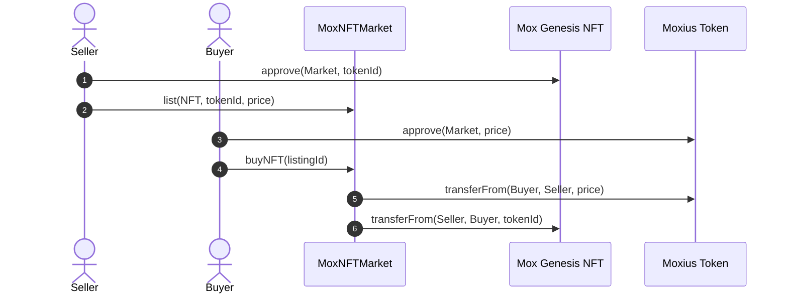
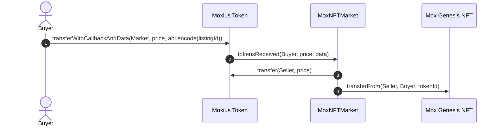

# MoxNFTMarket - Decentralized NFT Trading Protocol

A modular, secure decentralized NFT marketplace smart contract suite built on Ethereum using Solidity and Foundry. Developed by **JingMox** as part of the **Moxius** DeFi & Web3 ecosystem.

---

## Key Features

- **Decentralized NFT Marketplace (`MoxNFTMarket.sol`)**:
  - **Listing & Delisting**: NFT owners or approved operators can list ERC-721 tokens with price denominated in `Moxius (MOX)` tokens. Sellers can cancel active listings at any time.
  - **Dual Purchase Modes**:
    1. **Standard Purchase (`buyNFT`)**: Two-step flow via standard ERC-20 `approve()` + `buyNFT()`.
    2. **Hook-Based Instant Purchase (`tokensReceived`)**: One-step atomic purchase utilizing callback hooks (`transferWithCallbackAndData`), eliminating separate token approval overhead and cutting transaction friction.
  - **Reentrancy & State Safety**: Strict checks-effects-interactions pattern with immediate active flag updates and validation checks.

- **Ecosystem Payment Token (`ExtendedERC20.sol` - Moxius / MOX)**:
  - Custom ERC-20 token implementation (`Moxius`, symbol `$MOX`, 18 decimals, 100M total supply).
  - Supports callback hooks: `transferWithCallback` and `transferWithCallbackAndData` notifying receiver contracts adhering to `ITokensReceiver`.

- **NFT Collection (`ERC721.sol` & `MoxNFT`)**:
  - Standard compliant ERC-721 token implementation with safe minting, operator approvals, and receiver checks.
  - Built-in `Mox Genesis NFT` (`MOXNFT`) preset for zero-configuration testing and deployment.

---

## Project Structure

```
MoxNFTMarket/
├── src/
│   ├── MoxNFTMarket.sol         # Core NFT marketplace protocol & ITokenReceiver implementation
│   ├── ExtendedERC20.sol        # Moxius (MOX) token with callback hook capabilities
│   ├── ERC20.sol                # Standard Moxius (MOX) ERC20 implementation
│   ├── ERC721.sol               # Standard ERC721 implementation & Mox Genesis NFT (MOXNFT)
│   └── ITokensReceiver.sol      # Receiver interface for callback tokens
├── script/
│   └── DeployMoxNFTMarket.s.sol # Foundry deployment script for Token, Market, and NFT
├── test/                        # Contract test suites
├── .github/
│   └── workflows/
│       └── test.yml             # GitHub Actions CI automated pipeline
├── foundry.toml                 # Foundry build configuration & OpenZeppelin remappings
├── package.json                 # Project manifest, dependencies, and author metadata
└── README.md                    # Project documentation & architecture overview
```

---

## Trading Mechanics

### 1. Standard Purchase Workflow


### 2. Callback-Driven Instant Purchase Workflow (1 Transaction)


---

## Quick Start

### Build Contracts

```shell
forge build
```

### Run Tests

```shell
forge test -vvv
```

### Code Formatting

```shell
forge fmt
```

### Deploy to Network

Set your environment variables and execute the deployment script:

```shell
export PRIVATE_KEY=0x...
forge script script/DeployMoxNFTMarket.s.sol:DeployMoxNFTMarketScript \
  --rpc-url <RPC_URL> \
  --broadcast
```

---

## Author & License

- **Author**: [JingMox](https://github.com/JingMox)
- **License**: MIT
